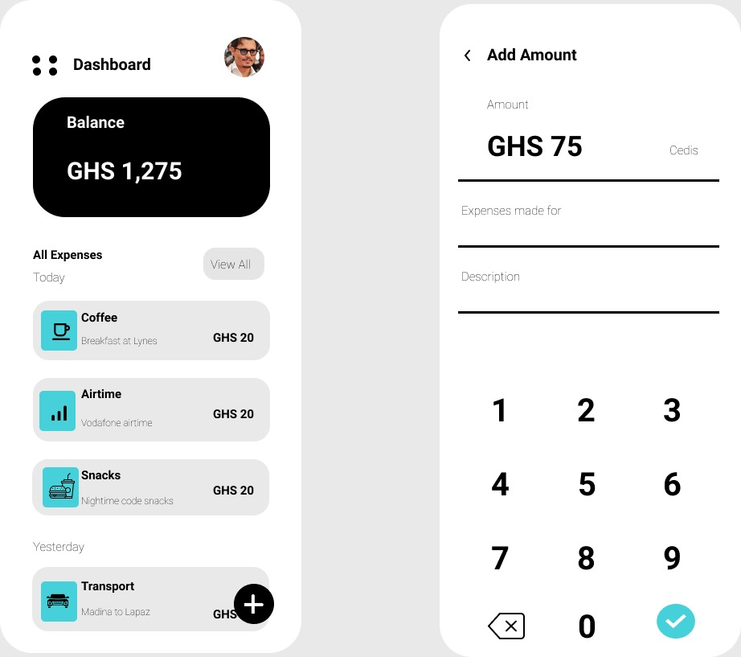
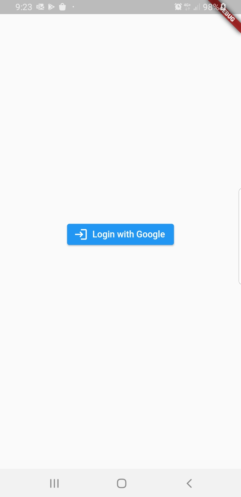
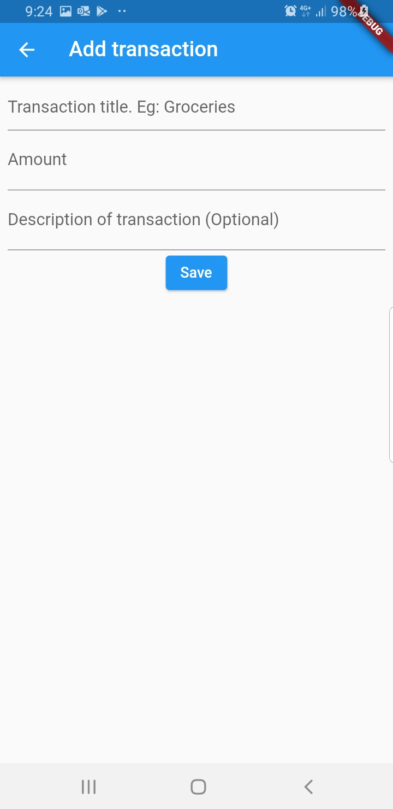
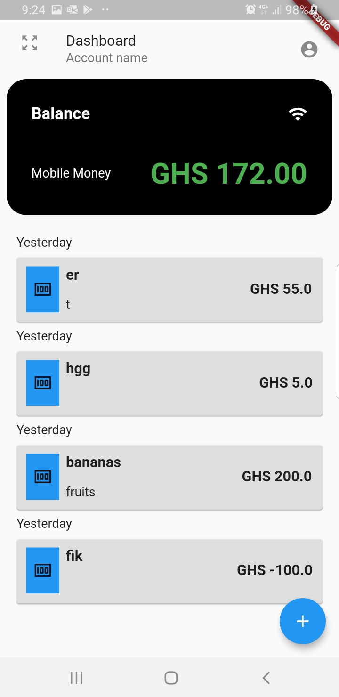
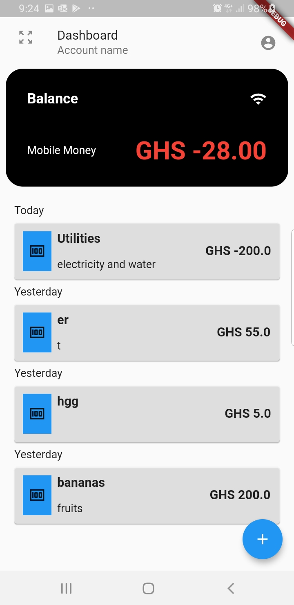

# moneybag
## Prefix
After finding an app I made back in 2018 (MoneyBag) when contemplating learning native Java for android,
 I decided to make an improved version of it using flutter. 
 In order to approximate my growth, I gave myself a deadline of 3 days for completion of a working prototype.

## App description
Money bag is an expense monitor that allows a user to keep track of his or her expenses. 
It provides the net sum of all the entered transactions(income and expenses).
 Using Firebase authentication and Firebase realtime database, this version of money bag (Money Box 2) 
 allows for multiple users to sign up using their google accounts. The realtime database is structured
  such that access to a user's transaction history is limited to the Google account with which that history was created. 
  Current version does not support transaction history for different categories (visa, mobile money, etc).

As at 25th January 2021, a user cannot directly delete an account made. However,
 I can delete the user's account if emailed (kwekuaacquaye@gmail.com) NOTE: kindly send me the email
  using the google account with which to signed up (for certainty of ownership)

## Functionality
- Google authentication
- Addition of transaction (negative values for expense, positive valuesfor income)
- Removal of transaction **
- account deletion **
- multiple transaction category **
- automation of transaction tracking for mobile money **

** => Yet to be implemented

## Images
The UI was designed by Elias Dzogbo of Ashesi University (class of 2023).

      
UI template 

     

     

